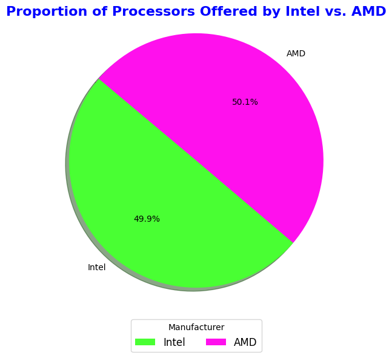
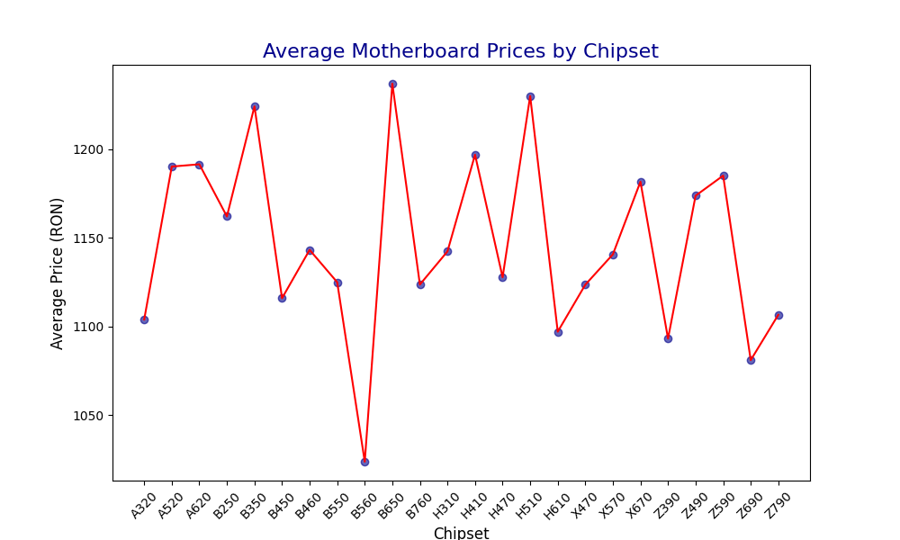
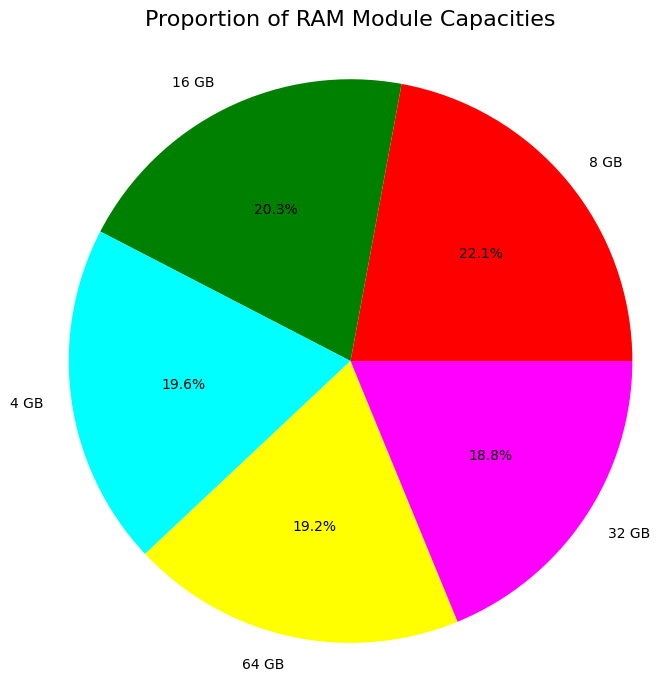
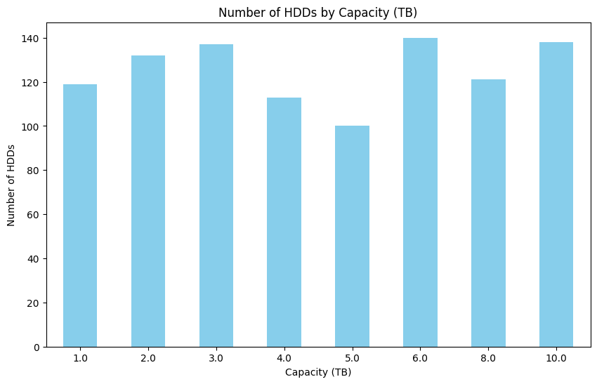

# Fake Data Generation for PC Components + Statistics & CSV & Charts
The following project was created as part of a master's course at Polytechnic University of Bucharest. 

The complexity of this project has not only expanded my proficiency in Python but also enabled me to delve into novel concepts and uncover my passions within the realm of IT.

## Description
This project uses the Faker library to generate fake data for various PC components such as processors, motherboards, RAM, HDDs, SSDs, power supplies, and video cards. 

After generating this data, it is saved in CSV files. 

The data is then read from these files and analyzed to extract statistics.

Finally, charts are created based on the analysis results.

## Table of Contents
- [Description](#description)
- [Project Structure](#project-structure)
- [Requirements](#requirements)
- [Usage](#usage)
- [Visualizations](#visualizations)
- [License](#license)

## Project Structure
- CSV/
  - processor_data.csv
  - motherboard_data.csv
  - ram_data.csv
  - hdd_data.csv
  - ssd_data.csv
  - powersupply_data.csv
  - videocard_data.csv
- images/
  - Charts/
    - processor_pie_chart.png
    - motherboard_scatter_plot_chart.png
    - ram_pie_chart.png
    - hdd_histogram_chart.png
    - ssd_histogram_chart.png
  - Components/
    - hdd.jpg
    - motherboard.jpg
    - powersupply.jpg
    - processor.jpg
    - ram.jpg
    - ssd.jpg
    - video_card.jpg 
- generate_data.py
- analyze_data.py
- README.md


## Requirements
<ul>
  <li>Python 3.7+</li>
  <li>Python libraries: Faker, pandas, matplotlib, seaborn, csv, statistics</li>
</ul>

## Installation

1. Clone this repository:
```
git clone https://github.com/username/pc-components-fake-data.git
cd pc-components-fake-data
```

2. Create a virtual environment (optional but recommended):
```
  python -m venv env
  source env/bin/activate  # for Unix
  .\env\Scripts\activate  # for Windows
```
3. Install the required dependencies:
```
  pip install -r requirements.txt
```

## Usage
Run the script to generate the data:
```
python generate_data.py
```

Run the script to analyze the data and generate visualizations:
```
python analyze_data.py
```

## Visualizations
The project generates various charts to visualize the fake data:

Proportion of processors offered by Intel vs. AMD


Average prices of motherboards by chipset


Proportion of RAM modules by capacity


Number of HDDs by capacity (TB)


## License
This project is licensed under the MIT License.
